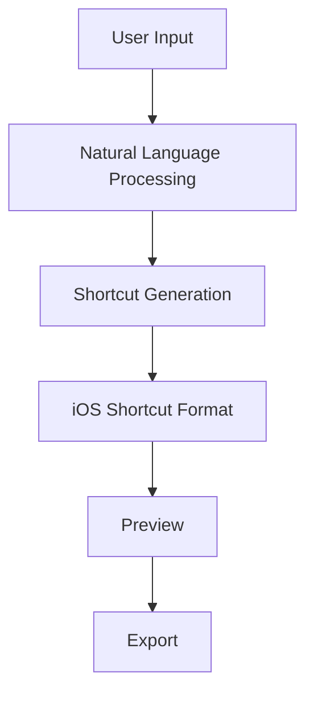

## AI Shortcut Generator - System Architecture

### 1. System Overview

The AI Shortcut Generator is a React-based web application that helps users create iOS shortcuts through natural language interaction. The system uses a modern, scalable architecture with TypeScript for type safety and robust error handling.

### 2. Core Components

#### Frontend Architecture
```
src/
├── components/           # Reusable UI components
│   ├── chat/            # Chat-related components
│   ├── shortcuts/       # Shortcut-related components
│   └── common/          # Shared components
├── hooks/               # Custom React hooks
├── services/            # API and external service integrations
├── store/               # State management
├── types/               # TypeScript type definitions
└── utils/               # Utility functions
```

#### Key Technologies
- React 18 with TypeScript
- Tailwind CSS for styling
- Headless UI for accessible components
- Vitest for testing
- React Query for data fetching
- Zod for runtime type validation

### 3. Data Flow



### 4. Security Measures

1. Input Validation
   - All user input validated using Zod schemas
   - Sanitization of user input before processing
   - Rate limiting on API endpoints

2. Authentication & Authorization
   - JWT-based authentication
   - Role-based access control
   - Secure session management

3. Data Protection
   - End-to-end encryption for sensitive data
   - Secure storage of user preferences
   - Regular security audits

### 5. Performance Optimization

1. Caching Strategy
   - React Query for API cache management
   - Local storage for user preferences
   - Service Worker for offline support

2. Code Splitting
   - Dynamic imports for large components
   - Lazy loading of routes
   - Optimized bundle size

### 6. Error Handling

1. Global Error Boundary
   - Graceful fallback UI
   - Error logging and monitoring
   - User-friendly error messages

2. API Error Handling
   - Retry mechanisms
   - Fallback strategies
   - Error reporting

### 7. Testing Strategy

1. Unit Tests
   - Component testing with Vitest
   - Service layer testing
   - Utility function testing

2. Integration Tests
   - API integration tests
   - End-to-end user flows
   - Performance testing

3. Coverage Requirements
   - Minimum 80% code coverage
   - Critical path coverage 100%
   - Regular test maintenance

### 8. Monitoring and Logging

1. Application Monitoring
   - Performance metrics
   - Error tracking
   - User behavior analytics

2. Logging System
   - Structured logging
   - Log levels and filtering
   - Audit trails

### 9. CI/CD Pipeline

1. Continuous Integration
   - Automated testing
   - Code quality checks
   - Security scanning

2. Continuous Deployment
   - Automated builds
   - Environment management
   - Rollback capabilities